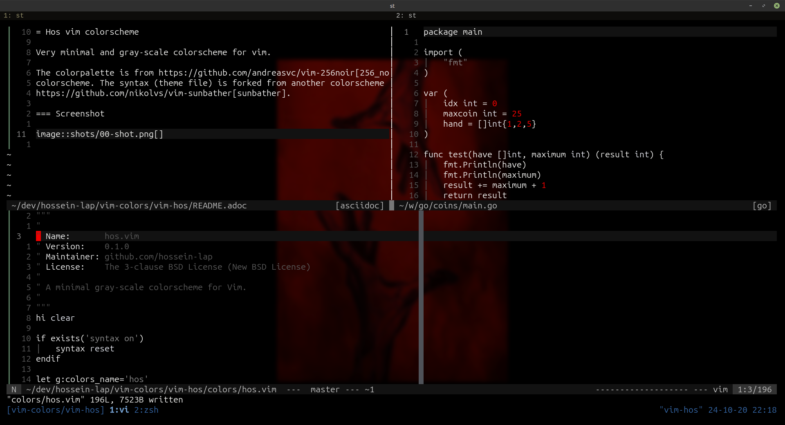

= Hos vim colorscheme

Very minimal and gray-scale colorscheme for vim.

The colorpalette is from https://github.com/andreasvc/vim-256noir[256_noir]
colorscheme. The syntax (theme file) is forked from another colorscheme called
https://github.com/nikolvs/vim-sunbather[sunbather].

=== Screenshot

